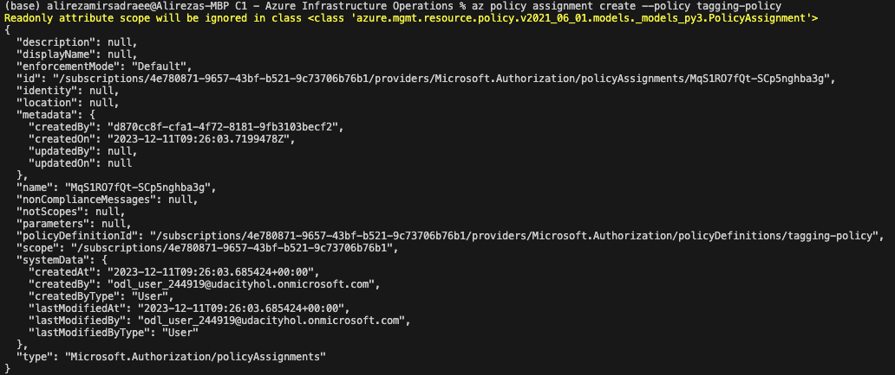
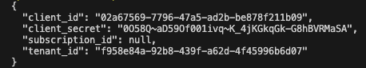
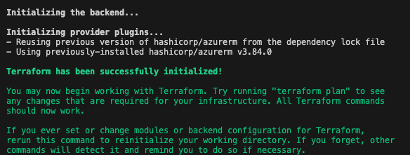
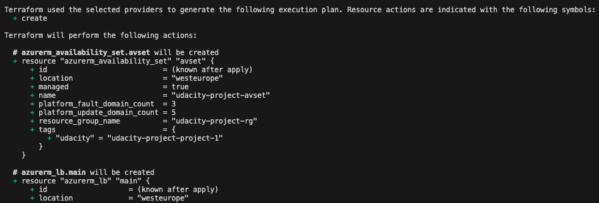
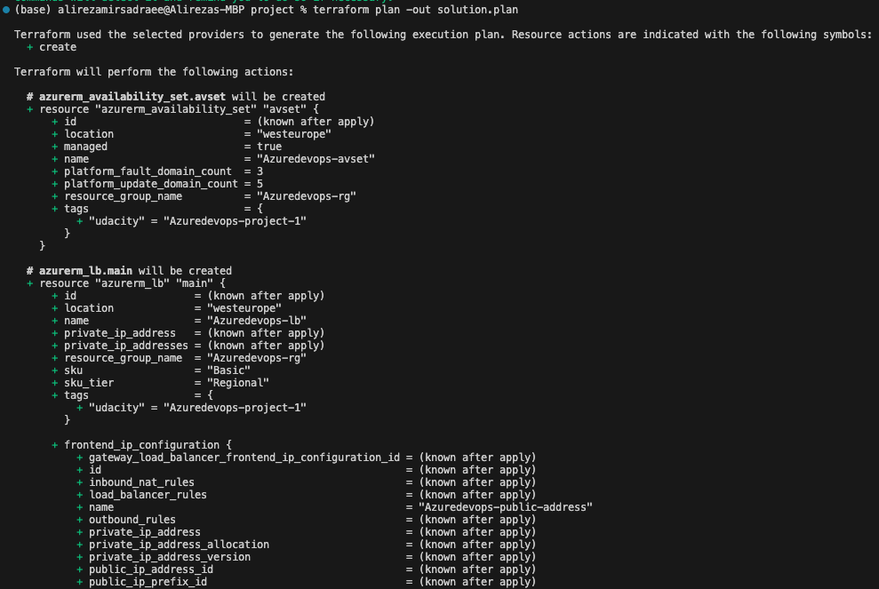
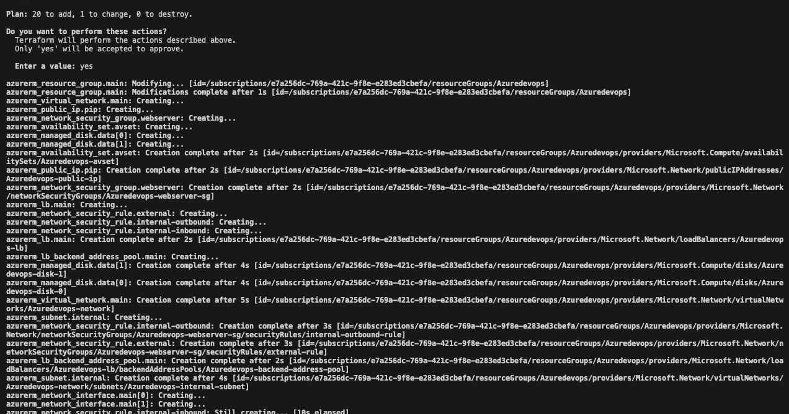
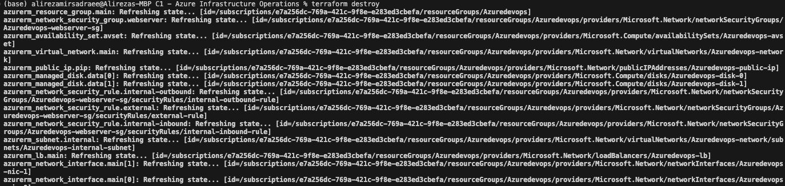
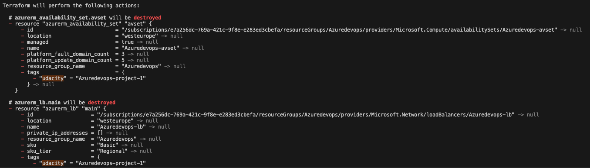
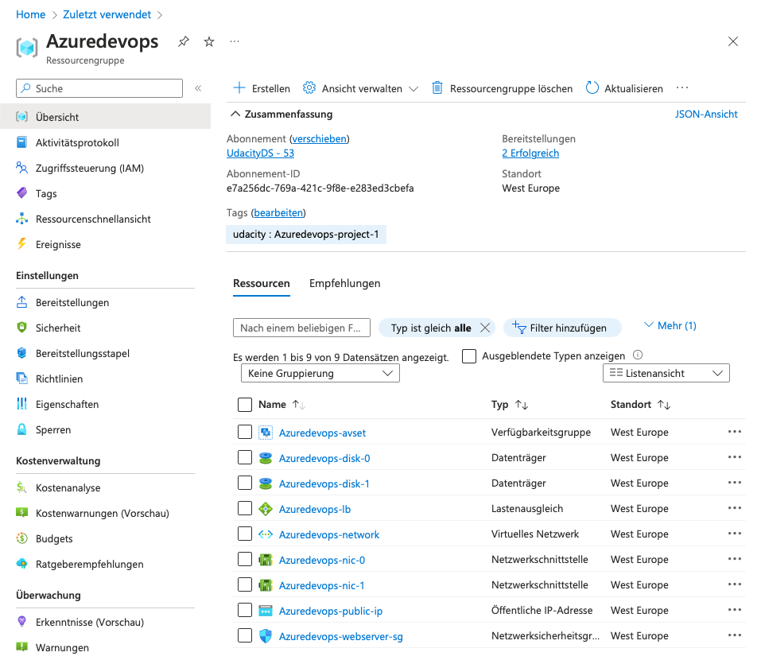

# Azure Infrastructure Operations Project: Deploying a scalable IaaS web server in Azure

### Introduction
For this project, you will write a Packer template and a Terraform template to deploy a customizable, scalable web server in Azure.

### Getting Started
1. Clone this repository

2. Create your infrastructure as code

3. Update this README to reflect how someone would use your code.

### Dependencies
1. Create an [Azure Account](https://portal.azure.com) [x]
2. Install the [Azure command line interface](https://docs.microsoft.com/en-us/cli/azure/install-azure-cli?view=azure-cli-latest) [x]
3. Install [Packer](https://www.packer.io/downloads) [x]
4. Install [Terraform](https://www.terraform.io/downloads.html) [x]

### Instructions
#### 1. Project Setup:
- Navigate to the repository
- Authenticate into Azure using Azure CLI: `az login`
The username and password are provided by Udacity Cloud Lab. In the azure credential the username and password are provided and in service principal details tab the detail on subscripts ID, Tenant ID, Application ID and so on. These information can be used in many steps of the task. One can also extract the needed information as soon as logged into the Azure. Using following command:

`az ad sp create-for-rbac --query "{client_id: appId, client_secret: password, tenant_id: tenant, subscription_id:subscription}"`

#### 2. Deploy a Policy:
Create a policy that ensures all indexed resources in the subscription have tags and deny deployment if they do not.

- Deploy a policy by running this script: `deploy_tagging_policy.sh`
- Create assignment: `az policy assignment create --policy tagging-policy`
- List policy assignements: `az policy assignment list`

The applied policy can be seen in following image:

The azure vriables are listed here using:

`az ad sp create-for-rbac --query "{client_id: appId, client_secret: password, tenant_id: tenant, subscription_id:subscription}"`

The results are:

Following commands can also be used to extract more data (from AI knowledge base):

`az account show`: Get the details of a subscription. (autogenerated)

`az account list`: Get a list of subscriptions for the logged in account. (autogenerated)

`az group list --query "[?location=='westus']"`: List all resource groups located in the West US region.

for subscription ID one can use:

`az account show --query id --output tsv`

#### 3. Packer Template
The first thing we're going to want to do is use Packer to create a server image, ensuring that the provided application is included in the template. 

Be sure to complete the following:
- Use an Ubuntu 18.04-LTS SKU as base image
- Ensure the correct privioners in `server.json`
- The same resource group should be sepcified for both Packer and Terraform.

packer can be built using following comamnd:

`packer build server.json`

#### 4. Terraform Template
The Terraform template allows to reliably create, update, and destroy our infrastructure. Consider that the Udacity Cloud Lab in the program does not allow to create new resource groupds.

Here are the main steps:
- Use the existing Resource Group. Udacity cloud lab in this program does not allow learners to create new Resource Groups.
- Create a Virtual network and a subnet on that virtual network.
- Create a Network Security Group. Ensure that you explicity allow access to other VMs on the subnet and deny direct access from the internet.
- Create a Network Interface.
- Create a Public IP.
- Create a Load Balancer. Your load balancer will need a backend address pool and address pool association for the network interface and the load balancer.
- Create a virtual machine availability set.
- Create virtual machines. Make sure you use the image you deployed using Packer!
- Create managed disks for your virtual machines.
- Ensure a $variables file$ allows for customers to configure the number of virtual machines and the deployment at a

#### 5. Deplying the Infrastructure
The packer can be built using following command:

`packer build server.json`

The terraform is used for deploying and then destroying the infrastructure:

`Terraform init`

`Terraform plan`

`Terraform plant -out solution.plan`

`terraform apply`

The resources have to be destroyed by following command:

`terraform destroy`

#### 6. Documentation

### Output
Running the Packer commands creates the following resources on the Azure portal and can be checked:

### Project Submission:
The following files are included in my Github repository for the purpose of the proejct:
- `main.tf`
- `vars.tf`
- `server.json`
- `solution.plan`
- `readme.md`