# Overview
## Cloud DevOps using Microsoft Azure - Second Project
In this project:
- A GitHub repository is built from scratch and a scaffolding is created that will assist in performing both `Continuous Integration` and `Continuous Delivery`. 
- The `GitHub Actions` is used along with a `Makefile`, `requirements.txt` and application code to perform an `initial lint`, `test`, and `install cycle`. 
- Finally, the project is integrated with Azure Pipelines to enable `Continuous Delivery` to `Azure App Service`.

A pre-trained, sklearn model that has been trained to predict housing prices in Boston according to several features, such as *average rooms in a home* and data about *highway access*, *teacher-to-pupil ratios*, and so on is provided by `Udacity`. Further Information about the data, which was initially taken from Kaggle, can be found on the [data source site](https://www.kaggle.com/c/boston-housing). 

This project will operationalize a Python flask app—in a provided file, `app.py` that serves out predictions (inference) about housing prices through API calls. This project could be extended to any pre-trained machine learning model, such as those for image recognition and data labeling.

The steps for preparation of the pipeline is given in figure below:


The main 4 steps for Agile project management are namely:
- Source Control
- Continuous Integration (CI)
- Continuous Delivery (CD)
- Platform as a Service (PaaS)


## Project Plan
For project planning and management two usefull tools are `Trello` and `Excel` for showing the progress and status of project progress.
* The [Trello](https://trello.com/b/F1yeX3wd/building-a-ci-cd-pipeline) board for the project to keep track of tasks and their status.
* The [Spreadsheet](project-management.xlsx) that includes the original and final project plan.

The GitHub repository holds the application codes, then it will be triggered by Azure Pipeline for build and deplyment. The deployed model will be run on web application to service out the APIs or websites. A comprehensive figure of the process is shown in following figure:

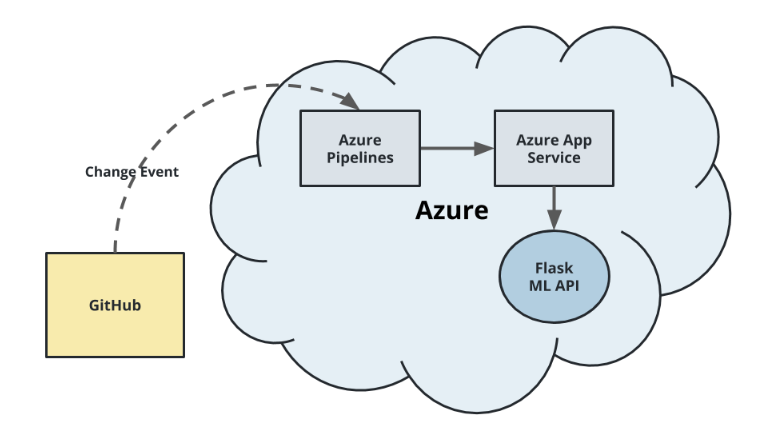 


## Instructions for Project
### CI: Set Up GitHub Repo & Azure Cloud Shell


An initial project structure is the setup of Azure Cloud Shell environment. A git repository is created and an Azure Cloud Shell environment is launched and GitHub Repository communication is integrated.

For connecting to GitHub repository, it is needed to generate a ssh-key:

```bash
ssh-keygen -t rsa
```

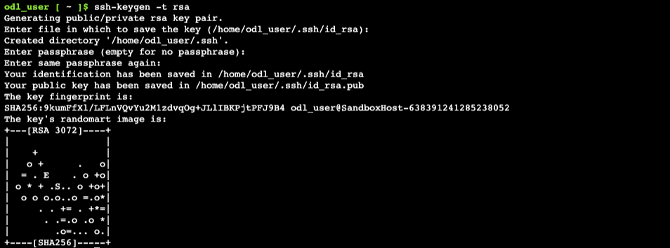

The ssh-key can be retreived over the shell through:

```bash
cat ~/.ssh/id_rsa.pub
```

Now the key has to be added to the GitHub as new ssh-key.

To clone the GitHub repository, following command has to be used in the Azure Cloud Shell:

```bash
git clone git@github.com:mirsadraee/Udacity_Cloud_DevOps_Microsoft_Azure_P2.git
```

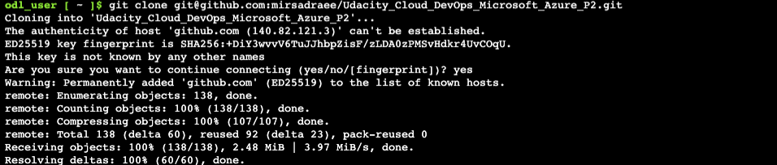

A virtual environment has to be setup:

```bash
make setup
```

Activate the virtual environment:

```bash
source ~/.udacity-devops/bin/activate
```

Install all dependencies and running lint in the virtual environment:

```bash
make all
```

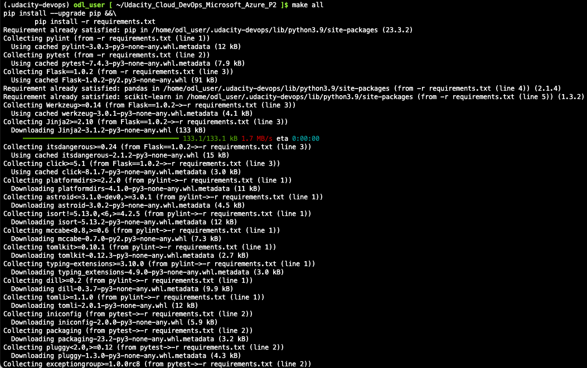

Now, we can run the application in the terminal using:

```bash
python app.py
```

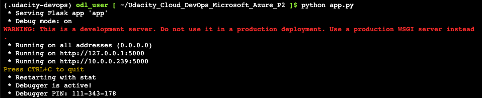

As the application is now running, we have to open a new terminal and test the application, consider changeing the path to the correct one using:

```bash
cd Udacity_Cloud_DevOps_Microsoft_Azure_P2`
```
```bash
./make_prediction.sh
```

The output of the run is:

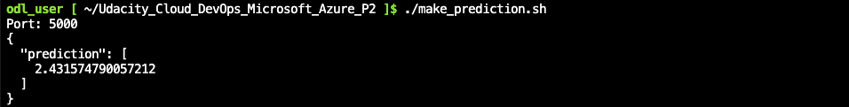

The application can be  stopped using `Ctrl+C` in the first terminal.

### Azure Web App
For deploying a Flask Machine Learning Application on Azure we have to setup many steps.

Refer to Azure Official [Documentation](https://learn.microsoft.com/en-us/azure/devops/pipelines/ecosystems/python-webapp?view=azure-devops) guide for complete instructions.

Next, create and configure the pipeline in Azure DevOps. More information on this process can be found here. The basic steps to set up the pipeline are:

- Logged into the [https://portal.azure.com/](https://portal.azure.com/)
- Created a DevOps org and a project at [https://dev.azure.com/](https://dev.azure.com/)
- Create a new private project.
- Under Project Settings create a new service connection to Azure Resource Manager, scoped to the subscription and resource group.
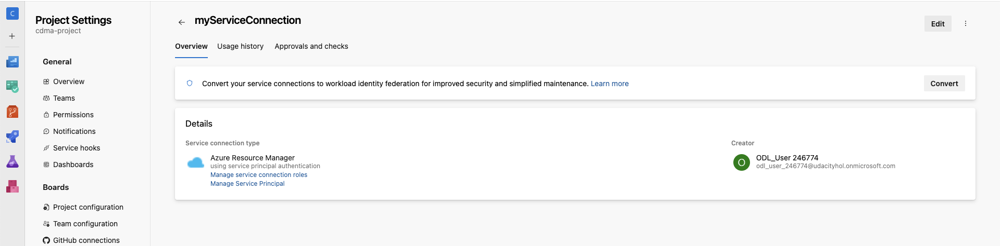

- Create Personal Action Tocken
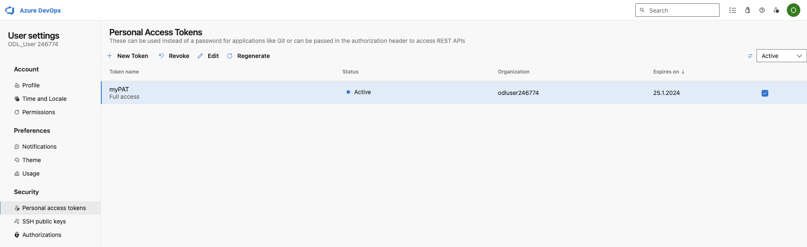

- Create Virtual Machine
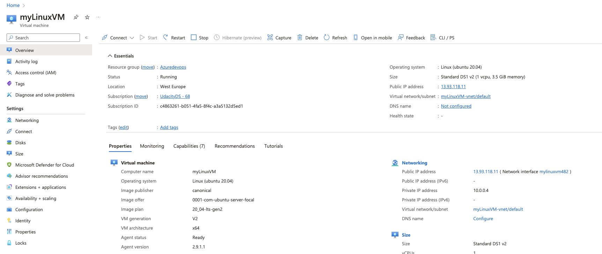

- Create AgentPool (The DevOps project should have a `self-hosted` Agent.)
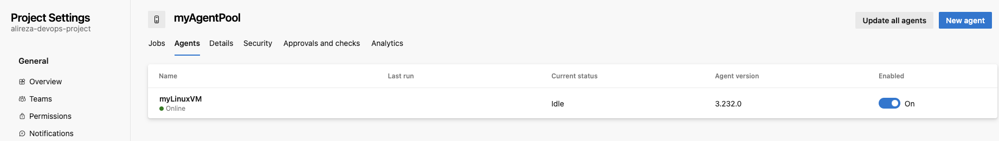
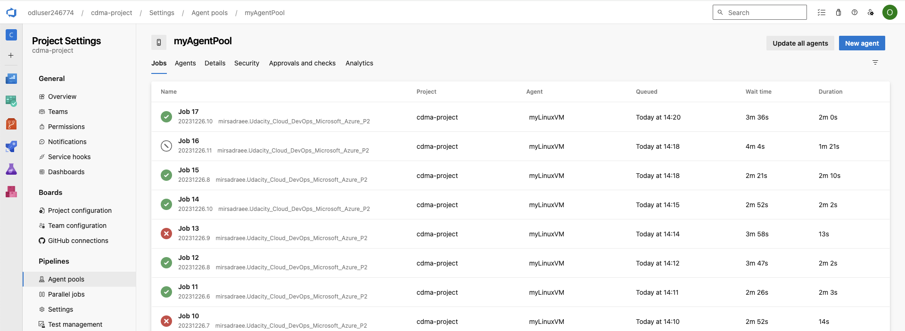

- Create a new pipeline (python to linux web app on azure)linked to your GitHub repo.
- Creating a new pipeline linked to the GitHub repo:
The pipeline `azure-pipeline.yaml` for build:

The pipeline `azure-pipeline.yaml` for build and deploy:
```yaml
# Python to Linux Web App on Azure
# Build your Python project and deploy it to Azure as a Linux Web App.
# Change python version to one thats appropriate for your application.
# https://docs.microsoft.com/azure/devops/pipelines/languages/python

trigger:
  - main
  - develop
  
  variables:
    # Azure Resource Manager connection created during pipeline creation
    azureServiceConnectionId: 'myServiceConnection'
  
    # Web app name
    webAppName: 'cdma-webapp'
  
    # Agent VM image name
    vmImageName: 'ubuntu-latest'
  
    # Environment name
    environmentName: 'cdma-webapp'
  
    # Project root folder. Point to the folder containing manage.py file.
    projectRoot: $(System.DefaultWorkingDirectory)
  
    # Python version: 3.8
    pythonVersion: '3.8'
  
  stages:
  - stage: Build
    displayName: Build stage
    jobs:
    - job: BuildJob
      pool: myAgentPool
      steps:
      - task: UsePythonVersion@0
        inputs:
          versionSpec: '$(pythonVersion)'
        displayName: 'Use Python $(pythonVersion)'
  
      - script: |
          python -m venv antenv
          source antenv/bin/activate
          python -m pip install --upgrade pip
          pip install setup
          pip install -r requirements.txt
        workingDirectory: $(projectRoot)
        displayName: "Install requirements"
  
      - task: ArchiveFiles@2
        displayName: 'Archive files'
        inputs:
          rootFolderOrFile: '$(projectRoot)'
          includeRootFolder: false
          archiveType: zip
          archiveFile: $(Build.ArtifactStagingDirectory)/$(Build.BuildId).zip
          replaceExistingArchive: true
  
      - upload: $(Build.ArtifactStagingDirectory)/$(Build.BuildId).zip
        displayName: 'Upload package'
        artifact: drop
  
  - stage: Deploy
    displayName: 'Deploy Web App'
    dependsOn: Build
    condition: succeeded()
    jobs:
    - deployment: DeploymentJob
      pool: myAgentPool
      environment: $(environmentName)
      strategy:
        runOnce:
          deploy:
            steps:
  
            - task: UsePythonVersion@0
              inputs:
                versionSpec: '$(pythonVersion)'
              displayName: 'Use Python version'
  
            - task: AzureWebApp@1
              displayName: 'Deploy Azure Web App : udacity-azure-project2'
              inputs:
                azureSubscription: $(azureServiceConnectionId)
                appName: $(webAppName)
                package: $(Pipeline.Workspace)/drop/$(Build.BuildId).zip
```

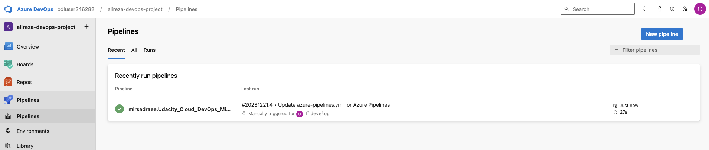

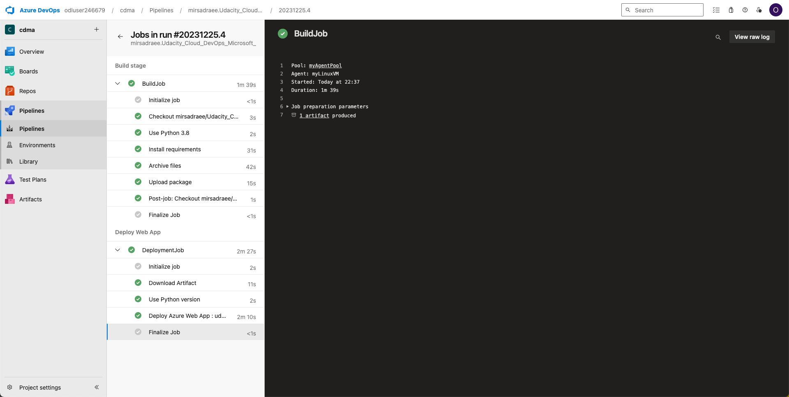

To run a webapp following command has to be used and modified based on our application name, resource group and other parameters.

```bash
az webapp config set -g <your-resource-group> -n <your-appservice> --startup-file <your-startup-file-or-command>
```
so the command has to be updated based on the resource group and app name, so:
```bash
az webapp up -n cdma-webapp -g azuredevops
```

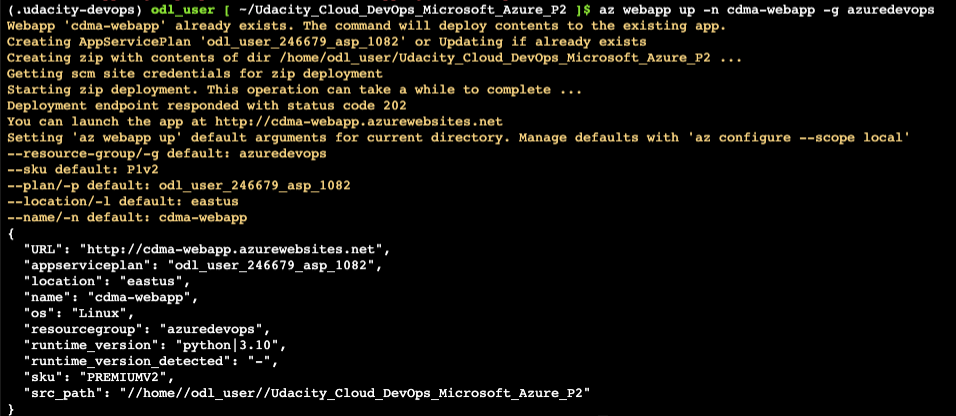

Verify the deployed application works by browsing to the deployed url
Go to line `-X POST https://<yourappname>.azurewebsites.net:$PORT/predic` in the `make_predict_azure_app.sh`, a successful prediction will look like this:

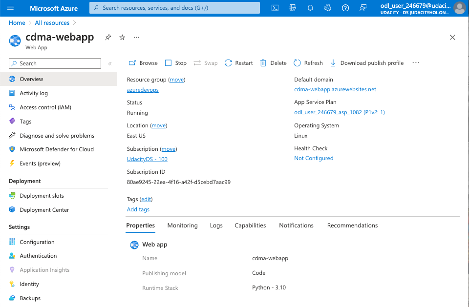

The web app is available under:

[https://cdma-webapp.azurewebsites.net](https://cdma-webapp.azurewebsites.net)

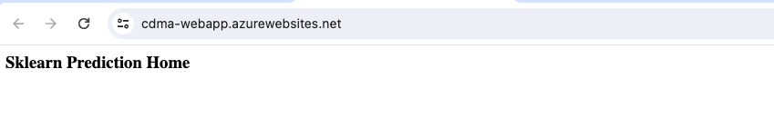

### Making predictions
Running `./make_predict_azure_app.sh` on the terminal results in:

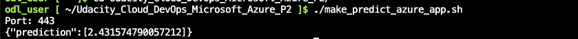

### Logs
You can inspect the logs from your running application here:

```bash
https://<app-name>.scm.azurewebsites.net/api/logs/docker
```

Or stream them:

```bash
az webapp log tail
```

### Load test using Locust
- The Readme should have a screenshot of the application running against a load test with locust.

```bash
pip install locust
```

```bash
locust
```
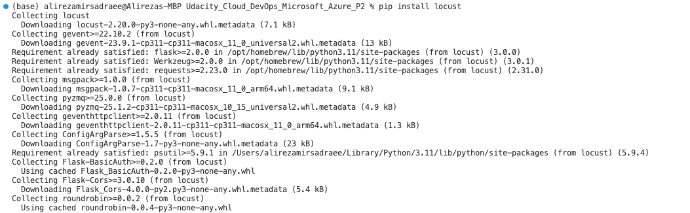

- There should be a `locustfile.py` file in the repo that is a working example of the load test script specified in the instructions.

- A running Locust for test against the deployed application is shown below:
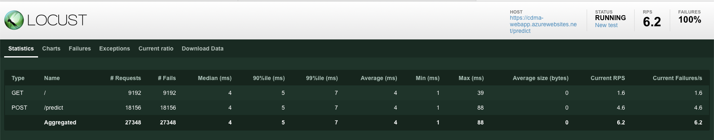
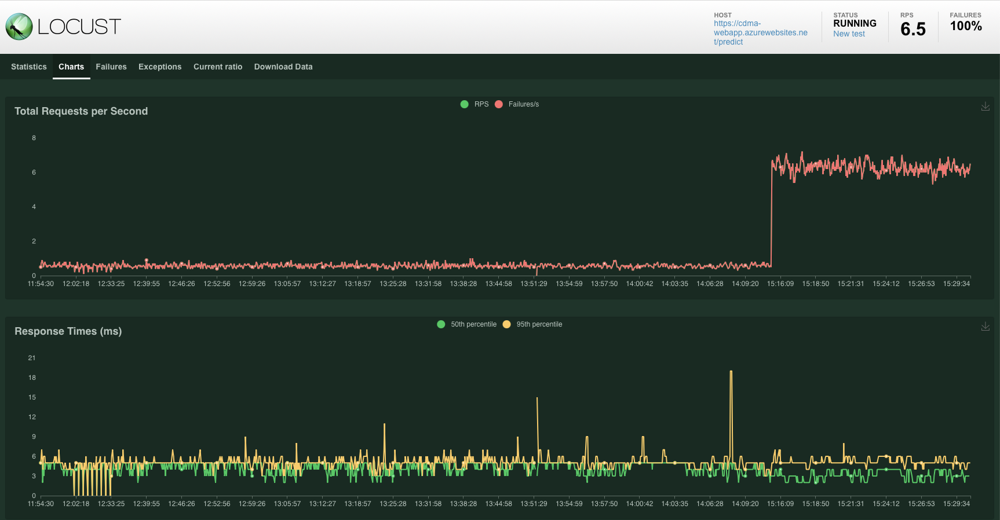

## Enhancements
The project can be improved by considering future steps:
- Using other prediction models and comparing their performance
- Add more scenarios for testing
- Increasing the load on the system to check the performance

## Demo 
See here for a [YouTube video](https://youtu.be/H7jjnCLFWRI) demonstrating the project.

## Licensing, Authors, and Acknowledgements
The data are taken for kaggle.com and a special thanks goes to Udacity for providing the data. The photos are partially taken from Udacity course as well.
Special thanks for great mentoring and learning program. 
