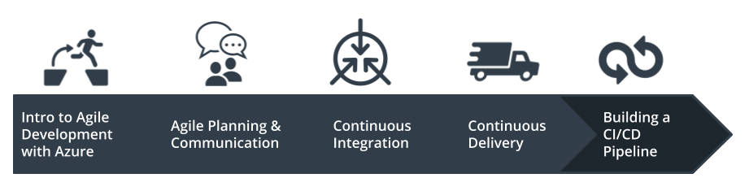
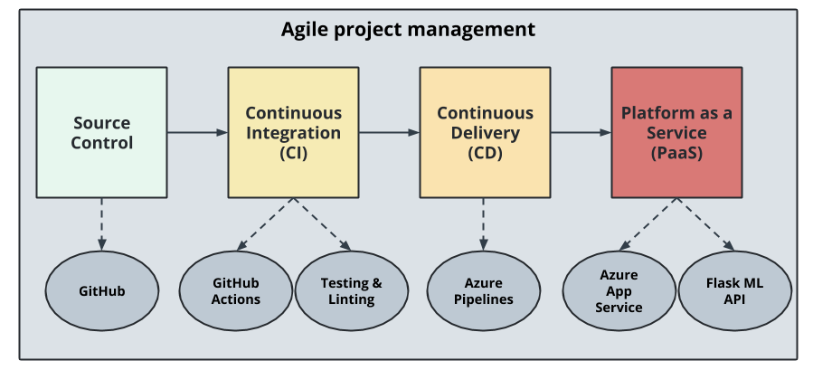

# Overview
## Cloud DevOps using Microsoft Azure - Second Project
## Building a CI/CD Pipeline

In this project:
- I will build a Github repository from scratch and create a scaffolding that will assist you in performing both Continuous Integration and Continuous Delivery. 
- I'll use Github Actions along with a `Makefile`, `requirements.txt` and application code to perform an initial lint, test, and install cycle. 
- Next, I'll integrate this project with Azure Pipelines to enable Continuous Delivery to Azure App Service.

A pre-trained, sklearn model that has been trained to predict housing prices in Boston according to several features, such as average rooms in a home and data about highway access, teacher-to-pupil ratios, and so on is provided by `Udacity`. Further Information about the data, which was initially taken from Kaggle, can be found on the [data source site](https://www.kaggle.com/c/boston-housing). 
This project will operationalize a Python flask app—in a provided file, `app.py` that serves out predictions (inference) about housing prices through API calls. This project could be extended to any pre-trained machine learning model, such as those for image recognition and data labeling.






## Project Plan
<TODO: Project Plan

* The [Trello](https://trello.com/b/F1yeX3wd/building-a-ci-cd-pipeline) board for the project to keep track of tasks and their status.
* The [Spreadsheet](project-management.xlsx) that includes the original and final project plan.
* See here for a YouTube video demonstrating the project.


## Instructions
### CI: Set Up Azure Cloud Shell


1. Create the Cloud-Based Development Environment:

   An initial project structure is the Azure Cloud Shell envirnoment is set up. A git repository is created and an Azure Cloud Shell environment is launched and Github Repository communication is integrated.

   To clone the Github repository, following command has to be used in the Azure Cloud Shell:
   `git clone git@github.com:mirsadraee/building-a-cicd-pipeline2.git`

   A virtual environment has to be setup:
   `make setup`

   Activate the virtual environment:
   `source ~/.udacity-devops/bin/activate`


2. Create Project Scaffolding
   The scaffolding for the project and testing the code is created.

<TODO:  
* Architectural Diagram (Shows how key parts of the system work)>

<TODO:  Instructions for running the Python project.  How could a user with no context run this project without asking you for any help.  Include screenshots with explicit steps to create that work. Be sure to at least include the following screenshots:

* Project running on Azure App Service

* Project cloned into Azure Cloud Shell

* Passing tests that are displayed after running the `make all` command from the `Makefile`

* Output of a test run

* Successful deploy of the project in Azure Pipelines.  [Note the official documentation should be referred to and double checked as you setup CI/CD](https://docs.microsoft.com/en-us/azure/devops/pipelines/ecosystems/python-webapp?view=azure-devops).

* Running Azure App Service from Azure Pipelines automatic deployment

* Successful prediction from deployed flask app in Azure Cloud Shell.  [Use this file as a template for the deployed prediction](https://github.com/udacity/nd082-Azure-Cloud-DevOps-Starter-Code/blob/master/C2-AgileDevelopmentwithAzure/project/starter_files/flask-sklearn/make_predict_azure_app.sh).
The output should look similar to this:

```bash
udacity@Azure:~$ ./make_predict_azure_app.sh
Port: 443
{"prediction":[20.35373177134412]}
```

* Output of streamed log files from deployed application

> 

## Enhancements

<TODO: A short description of how to improve the project in the future>

## Demo 

<TODO: Add link Screencast on YouTube>


